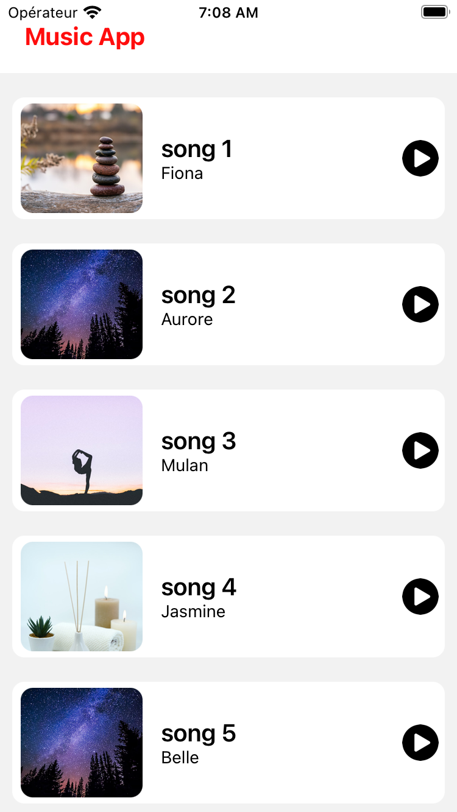
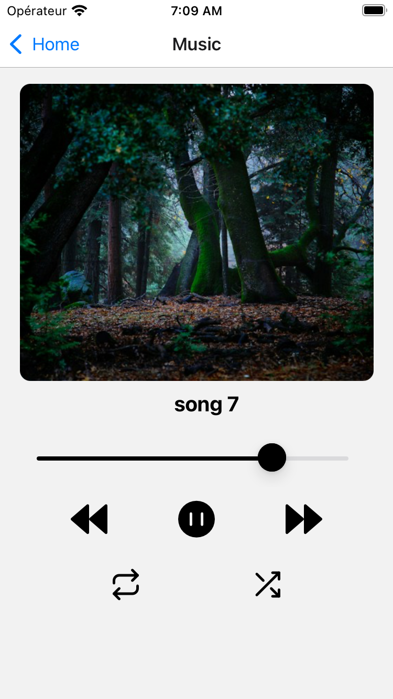

# R-native-audio-appli-v2

## Description

Une application React Native pour écouter de la musique, utilisant Expo et react-native-track-player.

## Installation

1. Clonez ce dépôt.
2. Exécutez `npm install` pour installer les dépendances.

## Configuration

- Assurez-vous d'avoir Expo installé localement.
- Configurez l'application avec la commande `eas build --profile development-simulator --platform ios`
  pour plus d'info (`https://docs.expo.dev/develop/development-builds/create-a-build/`)

## Utilisation

1. Exécutez l'application avec la commande `npx expo start`.
2. Ouvrez l'application sur votre simulateur ou appareil Expo.

## Captures d'écran

### Enregistrement d'écran 1

[]

## Dépendances Principales

- "@react-native-community/slider": "4.4.2"
- "@react-navigation/native": "^6.1.9"
- "expo": "~50.0.2"
- "react-native": "0.73.2"
- "react-native-track-player": "^4.0.1"
